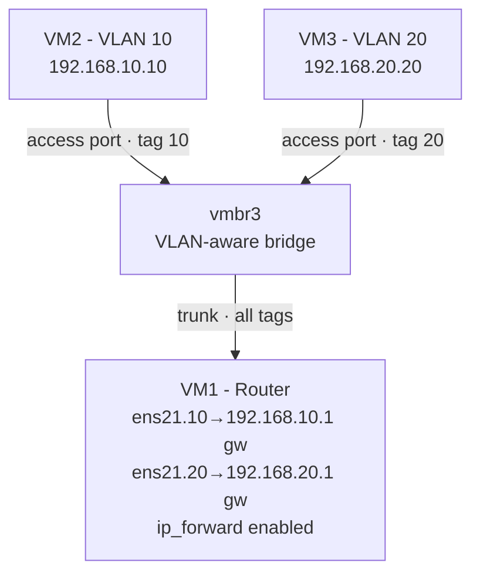
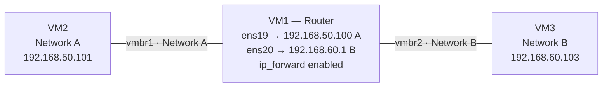
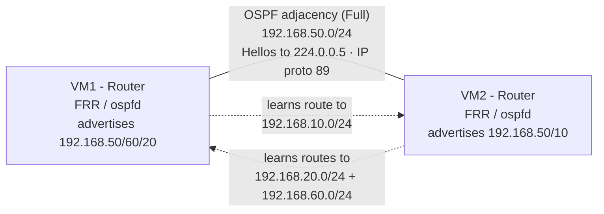

# proxmox-network-lab

A self built home networking lab on Proxmox VE, created to develop hands-on Linux and networking skills. The lab runs entirely on virtual machines and implements core networking concepts from the ground up: static routing, VLAN segmentation, router on a stick inter-VLAN routing, NAT, stateful firewalling with network segmentation, and OSPF dynamic routing plus secure remote access. All configured manually.

## Overview

- **Hypervisor:** Proxmox VE 9.2 (Type 1, bare metal)
- **Host hardware:** Ryzen 7 3700X, 16 GB DDR4
- **Guests:** Ubuntu Server 26.04 VMs, configured via Netplan
- **Remote access:** Tailscale (WireGuard-based mesh VPN)

This lab was built incrementally, with each milestone tested and verified before moving to the next. The goal was not just to make it work, but to understand *why* each piece works and to debug the failures along the way.

## Network Topology

The lab implements two distinct routing scenarios on isolated virtual networks.

### Inter-VLAN routing (router on a stick)

VM1 acts as a router, carrying both VLANs over a single trunk link and routing between them using tagged sub-interfaces, one gateway per VLAN.

### Static routing between isolated networks

VM1 also routes between two separate private networks (on different bridges), using a dedicated interface in each and static routes on the endpoints.

### OSPF dynamic routing (two routers)

VM1 and VM2 both run FRR and form an OSPF adjacency over their shared network (192.168.50.0/24). Each router advertises its own networks, and they exchange routes automatically instead of relying on static configuration.

The solid line is the adjacency link; the dashed lines show the routes each router learned from the other, with no static configuration.

## What's Implemented

### 1. Virtualization foundation
Proxmox VE installed on bare metal, with multiple Ubuntu Server VMs. Internal Linux bridges ('vmbr1', 'vmbr2', 'vmbr3') act as virtual switches to create isolated networks with no physical cabling.

### 2. Static routing between networks
VM1 configured as a router between two isolated subnets (192.168.50.0/24 and 192.168.60.0/24), using a dedicated interface per network and 'ip_forward' enabled. Endpoints use static routes to reach the remote network. Made persistent via '/etc/sysctl.d/'.

### 3. VLAN segmentation & inter-VLAN routing (router on a stick)
A VLAN-aware bridge carries two VLANS (10 and 20). VMs connect as access ports; VM1 connects via a trunk with a tagged sub-interface per VLAN acting as that VLAN's gateway. Demonstrates Layer 2 isolation and Layer 3 inter-VLAN routing over a single link.

### 4. Secure remote access
Tailscale (WireGuard-based mesh VPN) provides encrypted SSH access to the lab from anywhere, with no router/port-forwarding configuration required, useful since the lab runs on a network where the router is not under my control.

### 5. NAT for internet access
VM1 acts as a NAT gateway, using iptables masquerade on its internet-facing interface so isolated internal hosts can reach the internet through the router while keeping their private addresses. Endpoints that previously had no internet access (private IPs only, no public path) can now resolve DNS and reach external hosts. Made persistent with iptables-persistent so the rule survives reboots.

### 6. Stateful firewall & network segmentation
VM1 runs a default deny (least-privilege) firewall using iptables. The INPUT chain protects the router itself allowing loopback, established/related connections, and management traffic (Tailscale, OSPF) while dropping everything else. The FORWARD chain enforces an "internet yes, cross-segment no" policy: internal segments can reach the internet, but cannot reach each other, modeling real world segmentation (e.g. a guest VLAN that must not talk to a finance VLAN). Stateful connection tracking (ESTABLISHED,RELATED) allows return traffic for outbound connections while blocking unsolicited inbound. Rules made persistent with netfilter persistent.

### 7. OSPF dynamic routing (FRR)
A second VM (VM2) was promoted to a router, and both VM1 and VM2 run FRR's OSPF daemon. Instead of static routes, the two routers form an OSPF adjacency over their shared network and exchange routes automatically each learns the other's networks with no manually typed routes. Demonstrates link-state dynamic routing, neighbor adjacencies, and installation of learned routes into the kernel forwarding table.

## Skills Demonstrated

**Networking**
- Subnetting and CIDR
- Static routing and routing tables
- VLANs (802.1Q), access vs. trunk ports
- Inter-VLAN routing (router-on-a-stick)
- IP forwarding / Linux as a router
- Default routes and gateways
- Network segmentation and isolation
- NAT (masquerade / source NAT)
- Stateful firewalls and default-deny policy
- OSPF dynamic routing (link-state)
- Routing protocols and neighbor adjacencies

**Linux / Systems**
- Ubuntu Server administration
- Netplan network configuration
- systemd / sysctl persistent settings
- SSH (including jump hosts / bastion access)
- Command-line troubleshooting (`ip`, `ping`, `ip route`)
- iptables / netfilter (firewall rules, NAT, persistence)
- FRR (Free Range Routing) — OSPF via vtysh

**Virtualization & Infrastructure**
- Proxmox VE (Type 1 hypervisor)
- Virtual bridges and network design
- VM provisioning and management

**Security / Remote Access**
- VPN configuration (Tailscale / WireGuard)
- NAT traversal concepts
- Secure remote access without exposing services to the internet

## Challenges & Troubleshooting

Each milestone involved debugging. A few worth highlighting:

### Missing return route (static routing)
Cross-network pings failed even with `ip_forward` enabled. The packets reached
the destination, but replies had nowhere to go, the destination VM had no
route back to the source's network. **Fix:** add a route on the endpoint
pointing back through the router. This reinforced that routing must work in
*both* directions, a one-way path silently drops replies.

### Same-subnet VLAN gateways (inter-VLAN routing)
My first attempt put both VLAN gateways in the same subnet. Routing failed
because the router saw one network, not two there was nothing to route
between. **Fix:** give each VLAN its own subnet (one VLAN = one subnet). This
clarified that VLANs segment at Layer 2 while subnets segment at Layer 3, and
the two must align for inter-VLAN routing to work.

### Competing default routes
After connecting VMs to multiple networks, some had two default routes, causing
unpredictable path selection. **Fix:** keep a single default route and convert
the others into specific routes (e.g. `to: 192.168.60.0/24 via ...`). A host
can only have one sensible "everything else" path.

### Firewall blocking OSPF (stuck at Init)
After enabling OSPF, the neighbor relationship was stuck in the Init state VM2 could hear VM1's Hello packets, but the adjacency never progressed to Full. The cause was my own firewall: VM1's default-deny INPUT chain was silently dropping VM2's incoming OSPF Hellos. OSPF runs directly on IP protocol 89 (not TCP or UDP) and uses multicast, so a generic firewall doesn't permit it by default. Fix: add an INPUT rule allowing protocol 89 (iptables -A INPUT -p ospf -j ACCEPT). Because OSPF re-sends Hellos every 10 seconds, the adjacency self-healed to Full within seconds, with no restart needed. A textbook case of a security control breaking a routing protocol and diagnosing it came down to reading the neighbor state.

### Tailscale overlay vs. routed network
While testing firewall segmentation, pings between two VMs still succeeded even though the FORWARD rules should have blocked them. The reason: I was pinging the VMs' Tailscale (100.x) addresses, which travel over the encrypted Tailscale overlay (the tailscale0 interface) rather than through VM1's routing and FORWARD chain. Testing the internal VLAN addresses (192.168.x) correctly showed the traffic blocked. A useful reminder that a VPN overlay sits on top of and bypasses the physical routed network and its firewall.

### Boot hang on multi-interface VMs
VMs with several interfaces hung on boot (~2 minutes) waiting for systemd-networkd-wait-online to bring every interface "online" including a VLAN trunk that has no IP and never reaches a routable state, so the wait never succeeded. Fix: mark all non-management interfaces optional: true in Netplan, so boot only waits on the management interface. Note that optional: true is not inherited it must be set per interface, including each VLAN sub-interface. Verified with a clean reboot.

## Roadmap

Completed:
- [x] Static routing between isolated networks
- [x] Tailscale remote access
- [x] VLAN segmentation & inter-VLAN routing (router on a stick)
- [x] NAT for internet access
- [x] Stateful firewall & network segmentation
- [x] OSPF dynamic routing (via FRR)

Possible future additions:
- [ ] Migration to physical Cisco hardware for hands-on switch/router config (optional)

---

*Built and documented as part of developing hands-on networking and Linux
skills.*
