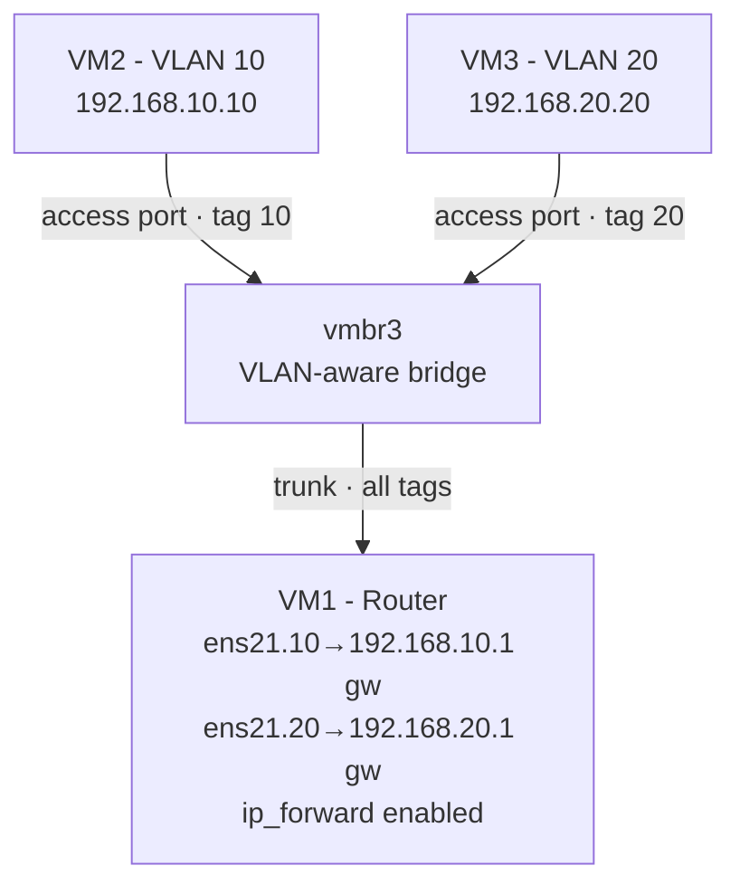
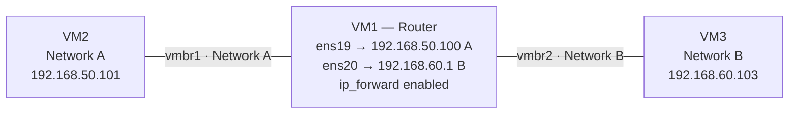

# proxmox-network-lab

A self built home networking lab on Proxmox VE, created to develop hands-on Linux and networking skills. The lab runs entirely on virtual machines and implements core networking concepts from the ground up: static routing, VLAN segmentation, router on a stick inter VLAN routing, and secure remote access. All configured manually.

## Overview

- **Hypervisor:** Proxmox VE 9.2 (Type 1, bare metal)
- **Host hardware:** Ryzen 7 3700X, 16 GB DDR4
- **Guests:** Ubuntu Server 26.04 VMs, configured via Netplan
- **Remote access:** Tailscale (WireGuard-based mesh VPN)

This lab was built incrementally, with each milestone tested and verified before moving to the next. The goal was not just to make it work, but to understand *why* each piece works and to debug the failures along the way.

## Network Topology

The lab implements two distinct routing scenarios on isolated virtual networks.

### Inter-VLAN routing (router on a stick)

VM1 acts as a router, carrying both VLANs over a single trunk link and routing between them using tagged sub-interfaces, one gateway per VLAN.

### Static routing between isolated networks

VM1 also routes between two separate private networks (on different bridges), using a dedicated interface in each and static routes on the endpoints.

## What's Implemented

### 1. Virtualization foundation
Proxmox VE installed on bare metal, with multiple Ubuntu Server VMs. Internal Linux bridges ('vmbr1', 'vmbr2', 'vmbr3') act as virtual switches to create isolated networks with no physical cabling.

### 2. Static routing between networks
VM1 configured as a router between two isolated subnets (192.168.50.0/24 and 192.168.60.0/24), using a dedicated interface per network and 'ip_forward' enabled. Endpoints use static routes to reach the remote network. Made persistent via '/etc/sysctl.d/'.

### 3. VLAN segmentation & inter-VLAN routing (router on a stick)
A VLAN-aware bridge carries two VLANS (10 and 20). VMs connect as access ports; VM1 connects via a trunk with a tagged sub-interface per VLAN acting as that VLAN's gateway. Demonstrates Layer 2 isolation and Layer 3 inter-VLAN routing over a single link.

### 4. Secure remote access
Tailscale (WireGuard-based mesh VPN) provides encrypted SSH access to the lab from anywhere, with no router/port-forwarding configuration required, useful since the lab runs on a network where the router is not under my control.

## Skills Demonstrated

**Networking**
- Subnetting and CIDR
- Static routing and routing tables
- VLANs (802.1Q), access vs. trunk ports
- Inter-VLAN routing (router-on-a-stick)
- IP forwarding / Linux as a router
- Default routes and gateways
- Network segmentation and isolation

**Linux / Systems**
- Ubuntu Server administration
- Netplan network configuration
- systemd / sysctl persistent settings
- SSH (including jump hosts / bastion access)
- Command-line troubleshooting (`ip`, `ping`, `ip route`)

**Virtualization & Infrastructure**
- Proxmox VE (Type 1 hypervisor)
- Virtual bridges and network design
- VM provisioning and management

**Security / Remote Access**
- VPN configuration (Tailscale / WireGuard)
- NAT traversal concepts
- Secure remote access without exposing services to the internet

