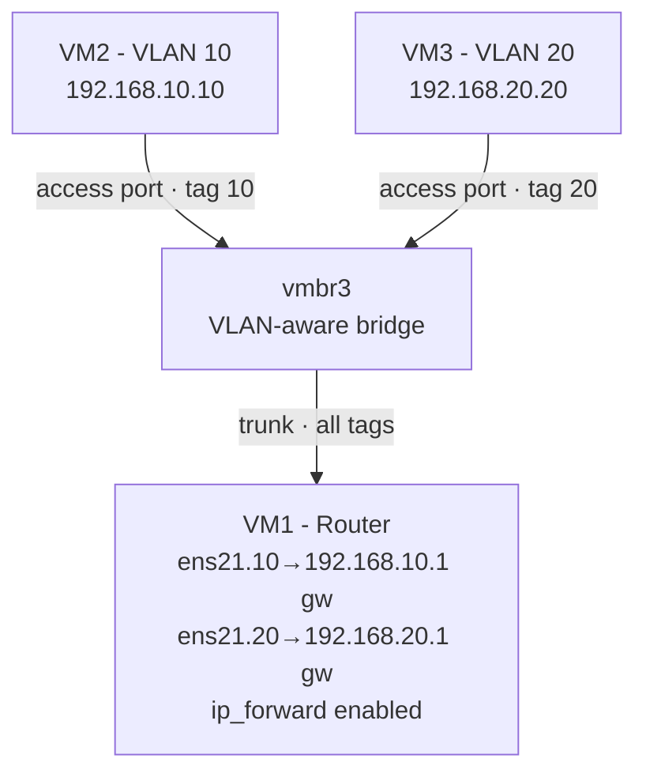
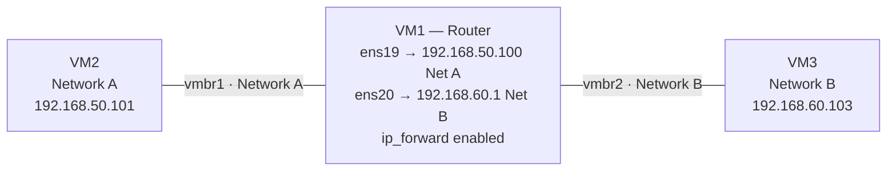

# proxmox-network-lab

A self built home networking lab on Proxmox VE, created to develop hands-on Linux and networking skills. The lab runs entirely on virtual machines and implements core networking concepts from the ground up: static routing, VLAN segmentation, router on a stick inter VLAN routing, and secure remote access. All configured manually.

## Overview

- **Hypervisor:** Proxmox VE 9.2 (Type 1, bare metal)
- **Host hardware:** Ryzen 7 3700X, 16 GB DDR4
- **Guests:** Ubuntu Server 26.04 VMs, configured via Netplan
- **Remote access:** Tailscale (WireGuard-based mesh VPN)

This lab was built incrementally, with each milestone tested and verified before moving to the next. The goal was not just to make it work, but to understand *why* each piece works and to debug the failures along the way.

## Network Topology

The lab implements two distinct routing scenarios on isolated virtual networks.

### Inter-VLAN routing (router on a stick)

VM1 acts as a router, carrying both VLANs over a single trunk link and routing between them using tagged sub-interfaces, one gateway per VLAN.

### Static routing between isolated networks

VM1 also routes between two separate private networks (on different bridges), using a dedicated interface in each and static routes on the endpoints.

